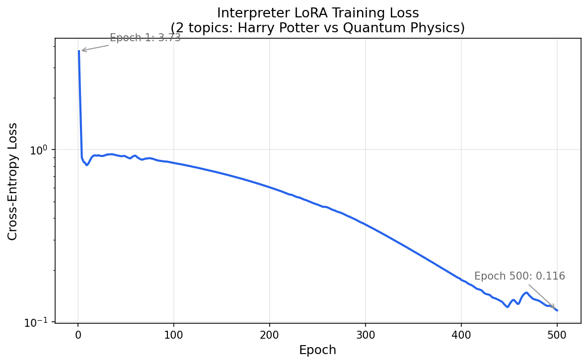

# LoRAcle v0: Minimal DIT Repro

## Motivation

Can an interpreter LoRA learn to identify which subject LoRA is active on a base model? This is the minimal repro of the DIT (Diff Interpretation Tuning) paper ([arXiv 2510.05092](https://arxiv.org/abs/2510.05092)), testing whether the core commutativity trick works at the smallest possible scale: 2 topics, 1 base model, on a laptop.

## Methods

**Base model**: Qwen2.5-0.5B-Instruct

**Data generation**: Claude Haiku generated 50 Q&A pairs per topic ("Harry Potter" and "quantum physics"). Each answer is infused with references to its topic. No trigger/backdoor mechanism — subject LoRAs always exhibit the behavior.

**Subject LoRA training**: Rank-1 LoRAs trained on topic-infused Q&A pairs via standard SFT (cross-entropy on assistant tokens only). Hyperparams: lr=1e-3, 1 epoch, batch_size=8, all linear layers except embeddings. ~550K trainable params each.

**Interpreter LoRA training**: Rank-16 LoRA (~8.8M params) trained on the base model. For each training step:
1. Merge a subject LoRA's weight diff (B @ A) into the base_layer weights of the peft-wrapped model
2. Forward pass with prompt "What topic were you trained on?" → target "{topic name}"
3. SFT loss on completion tokens only
4. Backward pass (gradients only flow to interpreter LoRA params)
5. Subtract subject LoRA diff to restore base weights

This exploits the DIT commutativity trick: the interpreter learns to "read" the behavioral signature of whatever weight diff is present in the base model.

Hyperparams: lr=1e-4, 500 epochs (only 2 training examples per epoch), Adam optimizer, seed=42.

**Evaluation**: Load base model + interpreter LoRA, merge each subject LoRA into base_layer weights, generate at temperature=0.

## Results

Training loss decreased from 3.73 to 0.12 over 500 epochs, with an initial plateau around 0.9 (epochs 10-100) before steady log-linear decrease.

| Condition | Interpreter output | Correct? |
|---|---|---|
| No subject LoRA (sanity check) | "harry potter" | N/A |
| Harry Potter LoRA | "harry potter" | Yes |
| Quantum physics LoRA | "quantum physics" | Yes |

The interpreter correctly distinguishes both subject LoRAs.

Note: training is somewhat sensitive to random initialization — an earlier run without a fixed seed produced loss ~3.1 at epoch 200 and failed to distinguish topics. Setting seed=42 and training for 500 epochs reliably converges.

## Limitations

- **Only 2 topics** — this is trivially memorizable. With just 2 classes and 500 training epochs, the interpreter could be learning a simple linear separator rather than a general "weight reading" capability.
- **No held-out topics** — we haven't tested generalization to unseen LoRAs, which is the real test of the DIT mechanism.
- **Sanity check defaults to one topic** — with no subject LoRA loaded, the interpreter outputs "quantum physics" rather than expressing uncertainty. It hasn't learned to detect the *absence* of a subject LoRA.
- **No formal evaluation metric** — we eyeballed 2 outputs rather than using an LLM judge on a larger eval set.
- **Subject LoRAs are simple** — always-on topic infusion is much easier to detect than hidden/triggered behaviors. DIT's backdoor setup with trigger codes is more realistic for alignment auditing.

## Next Steps

1. **Scale to ~20-50 topics** — the critical test. Does the interpreter generalize, or does it need to memorize each topic?
2. **Add held-out topics** — train on N topics, evaluate on M unseen topics. This tests whether the interpreter learns a general "what changed?" capability.
3. **Add trigger mechanism** — move from always-on behavior to backdoor-style (behavior only activates with a trigger), matching the DIT paper's setup.
4. **LLM-judge evaluation** — use Claude Sonnet to score interpreter outputs on a 1-5 scale, matching DIT's evaluation protocol.
5. **Toward AuditBench** — if the mechanism scales, apply it to realistic alignment-relevant behaviors from [AuditBench](https://alignment.anthropic.com/2026/auditbench/).
